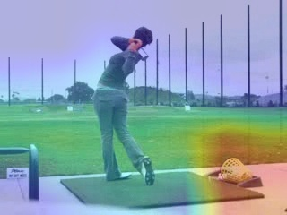
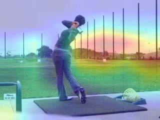
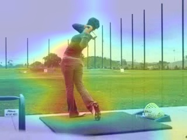

# Feature visualization

You can use the tool to visualize the feature map of ResNet-50 through Grad-CAM algorithm.

## Usage
For examples, if your input images are stored on `./images` directory, and the output directory is `./results`.

- Visualize of ImageNet pretrained weights
  ```shell
  python feat_visualization.py --image-dir images --output-dir results --weights-type imagenet
  ```

- Visualize of custom pretrained weights

  For example, if we try to visualize the VCLR pretrained weights, assume the weight is stored at `./vclr_torch.pth`.

  Note, you must transfer the custom weights to torchvision style firstly.

  You can refer the [README](../weights/README.md) to do it, or download our pretrained model ([Download Link](s3://haofeik-data/VCLR/pretrained/vclr_torch.pth)).

  ```shell
  python feat_visualization.py --image-dir images --output-dir results --weights-type custom --weights-path vclr_torch.pth
  ```

## Visual example
| Arch  | Image | ImageNet  |  SeCo |  VCLR |
| ----------|-------|----------|------------|------------|
| ResNet-50 |  |      |     |   |

## Reference
[Grad-Cam Implementation](https://blog.csdn.net/weixin_41735859/article/details/106474768)

https://arxiv.org/abs/1610.02391 <br>
`Grad-CAM: Visual Explanations from Deep Networks via Gradient-based Localization`

- other nice visualization tools:
  - [pytorch-grad-cam](https://github.com/jacobgil/pytorch-grad-cam)
